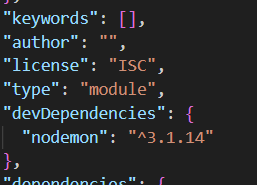
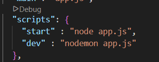

# NPM project

1. create project folder
2. right click on project folder and select open in integrated terminal
3. type `npm init -y` press enter
4. open package.json file from project folder
5. update `type` as `module` in package.json 
6. type in terminal `npm i nodemon -D` to install nodemon, which restarts server while file changes.
7. add 