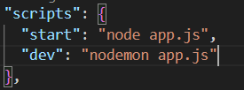

# Express
Fast, unopinionated, minimalist web framework for Node.js

1. create npm project
2. update package.json 
    `type:module`
3. install nodemon with `npm i nodemon -D`
4. install express with `npm i express`
5. update scripts in package.json to 
